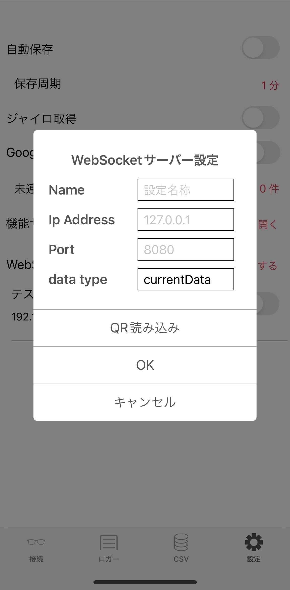

# 目次 Index
[TOC]

# JINS MEME x three-vrm
## 概要 Outline
JINS MEME Loggerとthree-vrmを使ってデバイスから得たジャイロセンサーの情報をWebSocket経由でVRMのモーションに反映させるプログラムです。


## WebSocketサーバー起動
ランタイムにDenoを使用しています。
インストールがまだの際は[マニュアルサイト](https://yoshixmk.github.io/deno-manual-ja/getting_started/installation.html)を参照してください。

インストール後、以下を実行します。

```sh
cd ./websocket-server
deno run --watch --allow-net --allow-read main.ts
```

## VRM MEME起動

```sh
cd ./vrm-meme
npm install
npm run dev
```

## WebSocketクライアントとの接続
### 1. Loggerアプリのダウンロード
Apple App Storeまたは、Google Play Storeから"JINS MEME Logger"と検索してダウンロードします。

### 2. JINS MEMEデバイスの接続
Loggerアプリの「接続」からデバイスを「検索」。


表示されたデバイスを選択し、「接続する」。


Loggerアプリとデバイスが接続されました。


続いてWebSocketクライアントの設定をします。
Loggerアプリの「設定」からWebSocketクライアントを「追加する」。
以下の項目を設定します。
- Name: 任意の設定名称
- Ip Address: PCのIPv4アドレス
- Port: 3000(変更する場合はmain.tsも編集)
- data type: デフォルトのcurrentDataのままで良い


WebSocketの接続が完了しました。
「ジャイロ取得」をオンにします。
